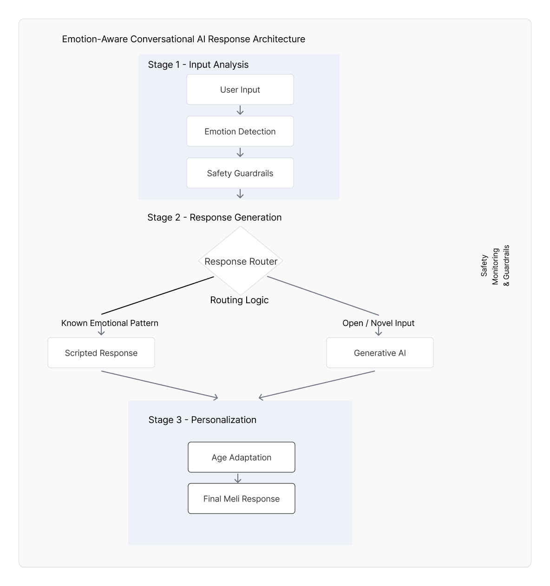

# meliworld-ai-prototype
Behavior-driven conversational AI system demonstrating agentic interaction design, routing logic, and safety-constrained AI responses.

# MeliWorld – Conversational AI Interaction Prototype

This project demonstrates a behavior-driven conversational AI system designed using hybrid deterministic and generative interaction models.

## Overview
MeliWorld is an emotionally intelligent AI companion that adapts responses based on user intent, emotional signals, and safety constraints.

## Key Concepts
- Conversational routing and branching logic
- Emotional signal detection
- Multi-step dialogue orchestration
- Safety-constrained AI interaction design
- Hybrid deterministic + LLM behavior system

## Purpose
This prototype was built to validate interaction logic, conversational flows, and AI behavior prior to production implementation.

## Tech
- HTML / CSS / JavaScript
- LLM integration (conceptual / simulated)

## Notes
This repository focuses on interaction system design and behavior modeling rather than production-scale engineering.

## System Architecture

